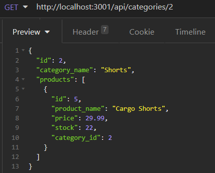
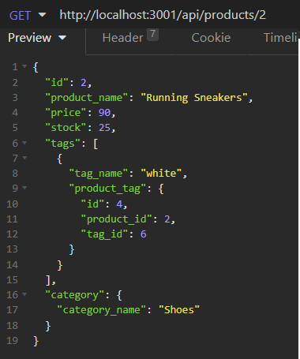
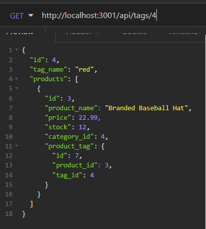
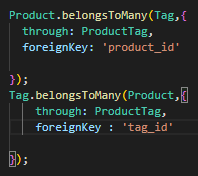

# ORM-shopping

This project is a demonstration of a entirely server side application that is used to update and view database informaiton. This is all done through requests made to the server to get back information or give informaton.<br>

[Link to Video Demo on Google Drive](https://drive.google.com/file/d/1DcvlNiQ0GnEVoXKv7-TPr3_TX0apZ0rl/view)

---

## Demo

Here is a short demonstration of the apps functionality from start to finish:


---

## Installation

To install the project in terminal run this command:

```bash
    git clone git@github.com:fiaschettima/ORM-shopping.git

```
The files will then be downloaded to the directory you ran the command in, Next run the following:
```bash
    cd ORM-shopping
    npm i
```
These commands will move you into the file, then install the npm packages the app requires for its functionality.
 Then you will need to create the initial database and seed it with starter data by doing the following:

 ```bash
    mysql -u root -p
    <copy and post contents of db/schems.sql here>
    npm run seed
```   
Now the initial database is created and the application will function as intended.

## Usage/Examples

To use the application 
```bash
    node server.js
```
This will Initialize the application

---
## Exmaple Responses








## Code Snippets

The code snippet diaplyed bellow is an example of setting up a squelize many to many association. 



---
**Client:** 

**Server:** Node, Express, Sequelize, MySQL, dotenv

---

## Lessons Learned

This project provided the oppurtunity to use sequelize and manage different potential associations.

---

## License

[MIT](https://choosealicense.com/licenses/mit/)

---

## Badges

[](https://github.com/tterb/atomic-design-ui/blob/master/LICENSEs)

---

## Authors

- [@Matt Fiaschetti](https://github.com/fiaschettima)

